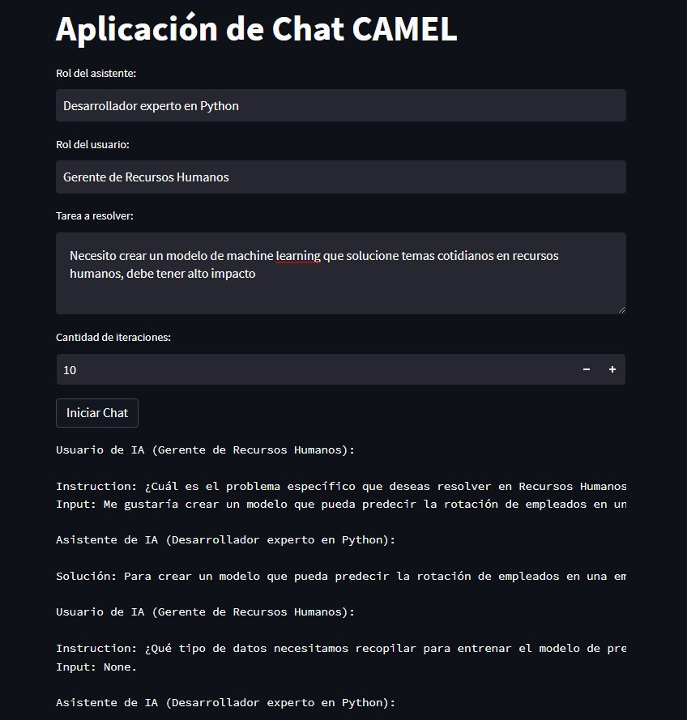

Aplicación de Chat CAMEL
Esta es una aplicación de chat llamada CAMEL (Chat Agent for Mining Enterprises). Permite interactuar con un asistente de IA para resolver una tarea específica. El asistente es capaz de recibir instrucciones y responder en base a ellas.

Cómo ejecutar la aplicación
Asegúrate de tener Python 3 instalado en tu sistema.
Clona o descarga el repositorio de la aplicación.
Abre una terminal en el directorio raíz de la aplicación.
Instala las dependencias requeridas ejecutando el siguiente comando:

pip install -r requirements.txt

Ejecuta la aplicación con el siguiente comando:
arduino

streamlit run app.py

Se abrirá una interfaz de usuario en el navegador web.

Ingresa el rol del asistente, el rol del usuario y la tarea a resolver en los campos correspondientes.
Establece la cantidad de iteraciones deseadas utilizando el control deslizante "Cantidad de iteraciones".
Haz clic en el botón "Iniciar Chat" para comenzar la conversación con el asistente.
El asistente y el usuario intercambiarán mensajes de acuerdo a las instrucciones y respuestas proporcionadas.
La conversación se mostrará en la interfaz de usuario y podrás ver los mensajes del asistente y del usuario.
Si deseas descargar la conversación, haz clic en el botón "Descargar Conversación". Se descargará un archivo de texto llamado "conversacion.txt" que contiene la conversación completa.
Requisitos
Python 3

Las dependencias necesarias están especificadas en el archivo requirements.txt. Puedes instalarlas ejecutando pip install -r requirements.txt.
¡Disfruta usando la aplicación de chat CAMEL y resuelve tus tareas de manera interactiva con el asistente de IA utilizando Streamlit!

